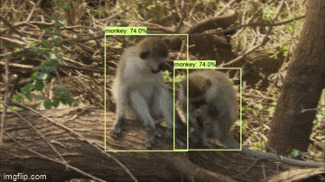

# Intelligent Security Camera

Security camera application powered by AI. It uses live video stream from camera feed or rtsp streaming from ip camera or cctv and use object detection to detect intruders in these feeds, when detected it send alert into mail along with the image it sensed as intruder so user can verify on spot. It also start recording video from the point it detects an intruder till that intruder is on sight of camera. This project is part of my work on a research project that deals with monkey theft detection and alert user when detected.

## Requirements

### System

System requirements depends on complexity or size of object detection model, larger model will require more compute power and will be good at detection. I have used this in a raspberry pi 3b with a pi camera using mobilenet backbone and it gave around 1-2 fps. For final implementation tflite model was used with pi which boost fps of application. With my Nvidia Geforce 940 MX GPU based system it is giving around 30 fps with mobilenet backbone. So here is tradeoff between compute power and accuracy.

### Python 3

Python 3.6 or higher. Tested with Python 3.6, 3.7, 3.8, 3.9 in Windows 10 and Linux.

### Packages

- `tensorflow-gpu>=2.0` or `tensorflow>=2.0`
- `numpy`
- `absl-py`
- `opencv-python`

This implementation is tested with tensorflow cpu and gpu 2.0, 2.2, 2.7 in Windows 10 and Linux

## Installation

### Install Python

There are two ways to install python in windows using [Python 3 installer](https://www.python.org/downloads/) or [Anaconda](https://docs.conda.io/projects/conda/en/latest/user-guide/install/index.html). Installing python with anaconda or [miniconda](https://docs.conda.io/en/latest/miniconda.html) is recommended. In linux Python 3 is installed by default but we can also install miniconda or conda into linux.

### Creating Virtual Environment

Create a new python virtual environment using conda or venv and activate it. If Anaconda or Miniconda is installed use `conda` else use `venv` to create virtual environments.

- Using conda

```bash
conda create --name security_cam
conda activate security_cam
conda install pip
```

- Using venv in linux

```bash
python3 -m venv path/to/create/env/security_cam
source path/to/create/env/security_cam/bin/activate
```

- Using venv in windows

```bash
python -m venv path\to\create\env\security_cam
path\to\create\env\security_cam\Scripts\activate
```

### Installing dependencies

The command below will install all the required dependencies from `requirements.txt` file.

```bash
pip install -r requirements.txt
```

### Setting up Email and Password

Saving Email and Password inside configuration file could be vulnerable to deal with this issue create environment variables for these fields. If you are using gmail account to send mail then you can create an App password instead of exposing your password visit [this guide](https://support.google.com/accounts/answer/185833) for more details.

#### Linux

```bash
export EMAIL_ADDRESS=<email_address@xyz.com>
export EMAIL_PASSWORD=<email_password_here>
```

to persist changes every time you open terminal after closing save it to `.bashrc` file in linux.

#### Windows

```bash
setx EMAIL_ADDRESS=<email_address@xyz.com>
setx EMAIL_PASSWORD=<email_password_here>
```

### Download Pretrained Object Detection Models

Any Object Detection model trained using TensorFlow object detection API format can be downloaded and loaded directly by specifing its path in config. Here are some of pretrained object detection models. After downloading the models copy and unzip model folder inside `data/models`

- [SSD MobileNet 4 classes](https://github.com/tarun-bisht/security-camera/releases/download/models/ssd_mobilenet_v2_320x320.zip)
- [SSD MobileNet FPNLite 4 classes](https://github.com/tarun-bisht/security-camera/releases/download/models/ssd_mobilenet_v2_fpnlite_320x320.zip)
- [SSD EfficientNet B0 4 classes](https://github.com/tarun-bisht/security-camera/releases/download/models/ssd_efficientdet_b0.zip)
- [TensorFlow Object Detection Models Zoo with coco weights](https://github.com/tensorflow/models/blob/master/research/object_detection/g3doc/tf2_detection_zoo.md)

### Additional guides:

If get stuck in installation part follow these additional resources

- [Python Installation](https://www.youtube.com/watch?v=YYXdXT2l-Gg&list)
- [pip and usage](https://www.youtube.com/watch?v=U2ZN104hIcc)
- [Anaconda installation and using conda](https://www.youtube.com/watch?v=YJC6ldI3hWk)

## Documentation

- Input Parameters for a script can be set by using config file.
- All configs file are located inside `configs` folder.
- Default config file loaded by app is `configs/security_cam.cfg` to load other config file send path to new config file as argument when running app also make sure format of config file is same.

### Running application with default parameters

```bash
python app.py
```

or

```bash
python app.py --config PATH/TO/CONFIG/FILE --live True
```

`app.py` takes two optional arguments:

- config: (Optional) path to config file. Defaults to `configs/security_cam.cfg`
- live: (Optional) If True a window will show the live camera feed useful. Defaults to True

### Examples

All examples take an optional argument `threshold` which neglects all detections with probability score less that that. Defaults to 0.5

#### Detect Objects in Image

Run this example script to detect objects in static images.

```bash
python examples/detect_image.py --model PATH/TO/MODEL --image PATH/TO/IMAGE --output PATH/TO/SAVE/OUTPUT/IMAGE
```

#### Detect Objects in Video Feed

Run this example script to detect objects in a video file.

```bash
python examples/detect_video.py --model PATH/TO/MODEL --video PATH/TO/VIDEO --output PATH/TO/SAVE/OUTPUT/VIDEO
```

#### Detect Objects in Camera Feed

Run this example script to detect objects in a camera feed.

```bash
python examples/detect_cam.py --model PATH/TO/MODEL --cam 0 --output PATH/TO/SAVE/OUTPUT/VIDEO
```

#### Detect Objects in IP Camera Feed (RTSP streaming)

Run this example script to detect objects in a rtsp streaming.

```bash
python examples/detect_ipcam.py --model PATH/TO/MODEL --ip CAMERA_IP --port STREAMING_PORT --username USERNAME_IF_NEEDED --password PASSWORD_IF_NEEDED  --output PATH/TO/SAVE/OUTPUT/VIDEO
```

## Detection Results

<div>
  <a href="https://youtu.be/FK4kqej6t5Q"></a>
</div>

## Contributions

Contributions are highly welcome that will improve quality of project.

## License

MIT LICENSE. Copyright (c) 2020 Tarun Bisht
